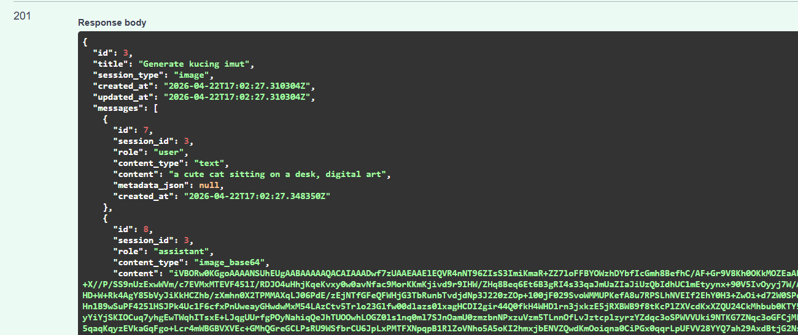
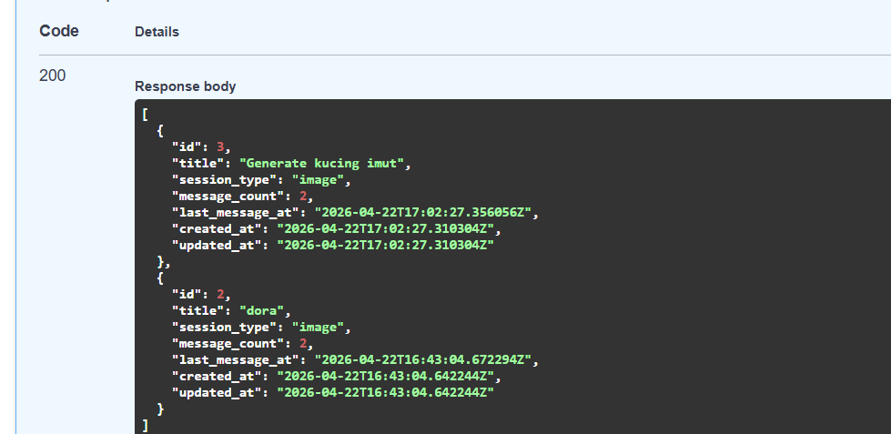

## Cloud App - STEAM

### 📖 Deskripsi Proyek

**Inti Rupa** adalah platform asisten cerdas berbasis cloud yang dirancang untuk membantu pengguna mengolah informasi secara lebih efisien. Aplikasi ini menggabungkan kekuatan **Analisis Teks** dan **Kreativitas Visual** dalam satu platform terintegrasi.

Dengan fitur **Summarizer**, pengguna dapat mengekstrak _"Inti"_ dari artikel panjang maupun foto dokumen hanya dalam hitungan detik. Didukung fitur **Generator**, pengguna juga dapat menciptakan _"Rupa"_ visual baru cukup dengan memberikan perintah teks sederhana.

**Inti Rupa** hadir sebagai solusi _all-in-one_ bagi siapa saja yang ingin **memahami informasi lebih cepat** dan **berkreasi tanpa batas**.

#### ✨ Fitur Utama

| Fitur                        | Deskripsi                                                                                                         |
| :--------------------------- | :---------------------------------------------------------------------------------------------------------------- |
| 🌐 Web Scraper & Summarizer  | Mengambil teks dari URL artikel yang diberikan                                                                    |
| 🖼️ Visual-to-Text Summarizer | Melakukan OCR pada gambar yang diunggah untuk mengekstrak teks, kemudian merangkum isinya                         |
| 🗂️ History & Cache           | Menyimpan riwayat ringkasan di database agar pengguna bisa melihat kembali hasil sebelumnya tanpa memproses ulang |
| 🎨 AI Image Generator ⭐     | Generate gambar secara otomatis berdasarkan deskripsi atau prompt yang diberikan pengguna                         |

---

### 🏗️ Architecture Overview

Sistem **Inti Rupa** menggunakan arsitektur **client-server** berbasis cloud. Frontend (React) berjalan di browser dan berkomunikasi dengan Backend (FastAPI) melalui HTTP request. Backend bertugas memproses setiap permintaan: scraping URL, OCR gambar, atau generate gambar sebelum diteruskan ke **Hugging Face API** sebagai AI nya. Setiap hasil diproses melalui **Cache Checker** terlebih dahulu untuk menghemat penggunaan API, lalu disimpan di **PostgreSQL Database** sebagai riwayat.

```
┌─────────────────────────────────────────────────────────────┐
│                        USER BROWSER                         │
│                      (React Frontend)                       │
└────────────────────────────┬────────────────────────────────┘
                             │ HTTP Request
                             ▼
┌─────────────────────────────────────────────────────────────┐
│                    BACKEND (FastAPI)                        │
│                                                             │
│  ┌───────────┐  ┌───────────┐  ┌───────────┐  ┌─────────┐   │
│  │   Web     │  │   OCR     │  │  History  │  │  Image  │   │
│  │ Scraper   │  │  Module   │  │  Endpoint │  │  Gen    │   │
│  │ Endpoint  │  │ Endpoint  │  │           │  │Endpoint │   │
│  └─────┬─────┘  └─────┬─────┘  └─────┬─────┘  └─────┬───┘   │
│        └──────────────┼──────────────┘              │       │
│                       │        ┌────────────────────┘       │
│              ┌────────┴────────┐                            │
│              │  Cache Checker  │                            │
│              └────────┬────────┘                            │
└───────────────────────┼─────────────────────────────────────┘
            ┌───────────┴───────────┐
            │                       │
            ▼                       ▼
┌──────────────────────┐  ┌────────────────────────┐
│  Hugging Face API    │  │  PostgreSQL Database   │
│  - Summarizer        │  │  (History & Cache)     │
│  - Image Generator   │  │                        │
└──────────────────────┘  └────────────────────────┘
```

---

### 👥 Team Member

| Nama                              | NIM      | Peran               |
| :-------------------------------- | :------- | :------------------ |
| Irfan Zaki Riyanto                | 10231045 | Lead Backend        |
| Incha Raghil                      | 10231043 | Lead Frontend       |
| Jonathan Cristopher Jetro         | 10231047 | Lead DevOps         |
| Jonathan Joseph Yudita Tampubolon | 10231048 | Lead Lead QA & Docs |

### 🛠️ Tech Stack

| Teknologi        | Fungsi                                       |
| :--------------- | :------------------------------------------- |
| FastAPI          | Backend REST API                             |
| React            | Frontend SPA                                 |
| PostgreSQL       | Database                                     |
| Docker           | Containerization                             |
| GitHub Actions   | GitHub Actions                               |
| Railway/Render   | Cloud Deployment                             |
| Hugging Face API | Generative AI (Summarizer & Image Generator) |

---

### 📅 Roadmap

| Minggu | Target                 | Status |
| :----- | :--------------------- | :----: |
| 1      | Setup & Hello World    |   ✅   |
| 2      | REST API + Database    |   ⬜   |
| 3      | React Frontend         |   ⬜   |
| 4      | Full-Stack Integration |   ⬜   |
| 5-7    | Docker & Compose       |   ⬜   |
| 8      | UTS Demo               |   ⬜   |
| 9-11   | CI/CD Pipeline         |   ⬜   |
| 12-14  | Microservices          |   ⬜   |
| 15-16  | Final & UAS            |   ⬜   |

## 🧪 Hasil Pengujian API

Berikut adalah detail skenario pengujian yang telah dilakukan


## 🧪 Hasil Pengujian API

Berikut adalah detail skenario pengujian yang telah dilakukan pada API sistem **Inti Rupa**.

### 1. POST /chat/sessions — Create New Chat Session



Endpoint ini digunakan untuk menginisialisasi atau membuat sesi chat baru di dalam database. Pengguna perlu mengirimkan payload berupa judul sesi dan tipe sesi. Sistem akan merespon dengan status **201 Created** beserta data sesi yang baru saja dibuat, termasuk daftar pesan awal jika sudah ada.

### 2. GET /chat/sessions — Retrieve Chat Sessions



Endpoint ini digunakan untuk mengambil daftar seluruh sesi chat yang tersimpan. Sistem akan mengembalikan *array* berisi objek sesi, yang memungkinkan pengguna untuk melihat riwayat percakapan mereka.


