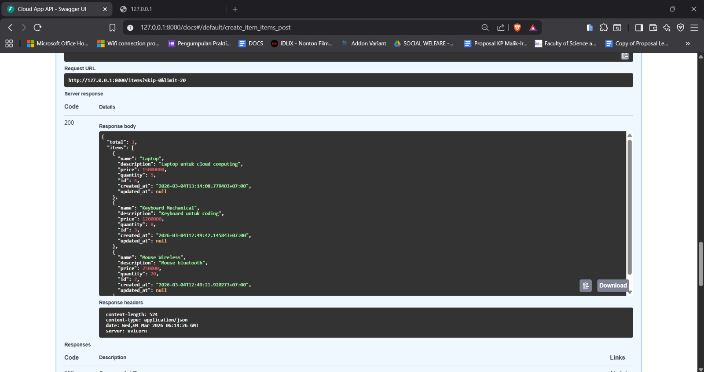
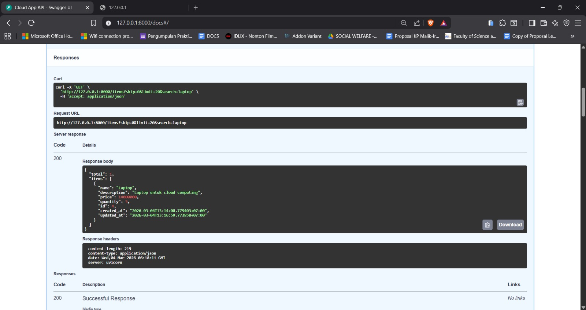
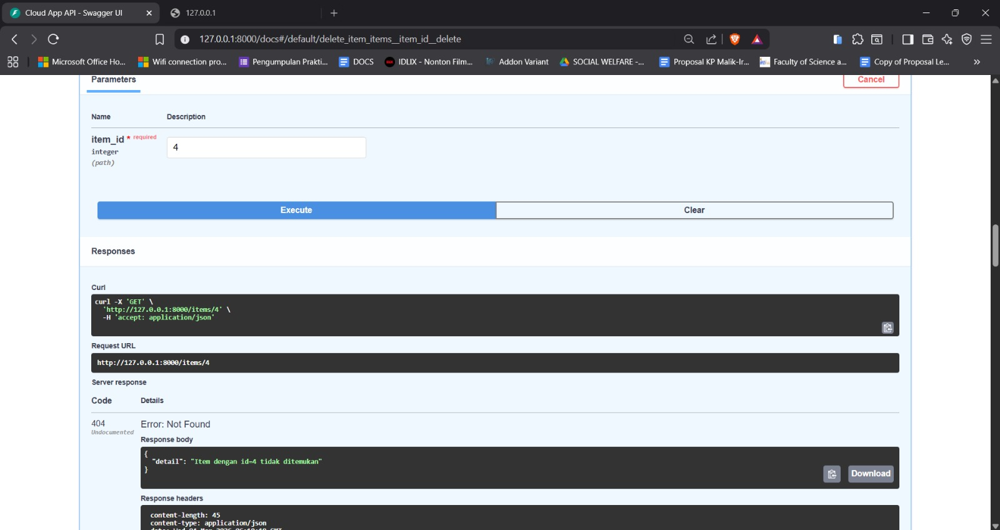

## Hasil Test API
### POST/Items - Buat 3 item

Gambar di atas menunjukkan hasil penambahan 3 items berupa:
- nama item yaitu "Laptop"
- price dengan harga "15000000"
- description yaitu "Laptop untuk cloud computing"
- quantity yaitu "5"

### GET/Items-harus mengembalikan 3 items dengan total: 3

Mengambil data dari item yang dimasukkan, tampilan di atas menunjukkan bahwa item-item yang telah didaftarkan telah tersimpan ke dalam database, dan data tersebut ditampilkan saat menjalankan query ```GET```.

### GET /items/4 — Harus mengembalikan item "Laptop"

Pada tampilan di atas, dilakukan perintah untuk menampilkan salah satu data item dengan id `4`, sehingga data yang ditampilkan adalah item laptop dengan id yang sesuai.

### GET /items/stats

Gambar di atas menunjukkan tahap untuk menampilkan statistik/ringkasan dari semua item yang ada di dalam database.
Berikut beberapa nilai yang dikembalikan:
- ```total_item``` : untuk menghitung jumlah total item yang ada di database
- ```total_value``` : menghitung total nilai semua item dengan rumus ```price x quantity``` lalu dijumlahkan
- ```most_expensive``` : mencari item dengan harga tertinggi
- ```cheapest``` mencari item dengan harga terendah

### PUT /items/4 — Update harga:

Pada tahap ini, dilakukan proses update harga laptop dari yang awalnya adalah `15000000` menjadi `14000000`.

### GET /items/4 — Harga harus berubah ke 14000000

Berdasarkan gambar yang ditampilkan, database telah berhasil menyimpan hasil update harga yang telah diubah menjadi `14000000`.

### GET /items?search=laptop — Harus mengembalikan 1 item

Gambar di atas merupakan proses yang dilakukan untuk menampilkan data laptop yang telah di-update.

### DELETE /items/4 — Harus response 204

Proses di atas merupakan proses penghapusan item yaitu laptop dengan id `4` menggunakan perintah `DELETE`.

### GET /items/4 — Harus response 404

Gambar terakhir menampilkan `404` yang berarti bahwa data item yang telah dihapus sudah tidak ada lagi di dalam database.
