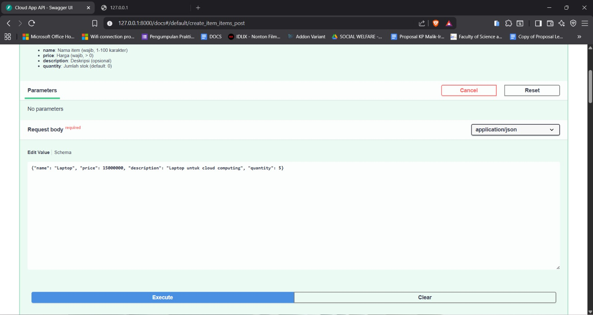
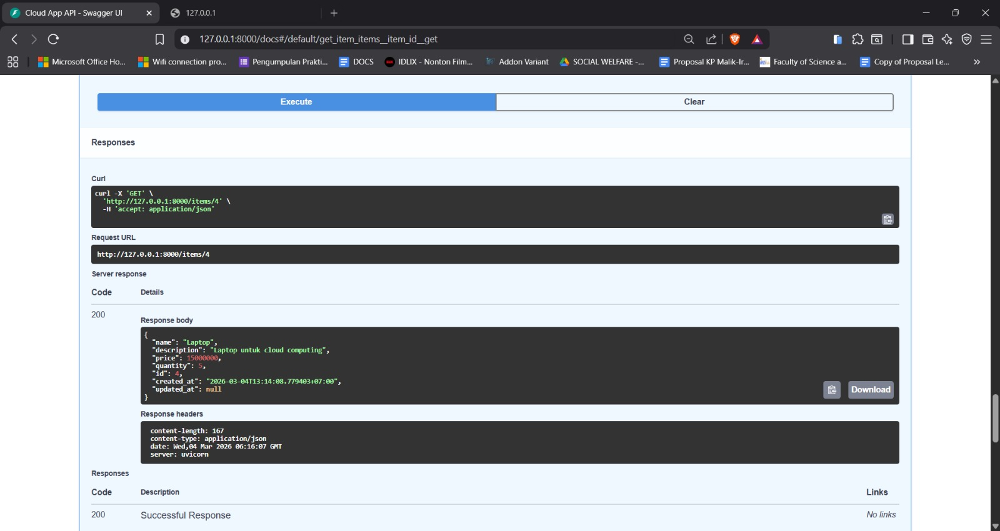
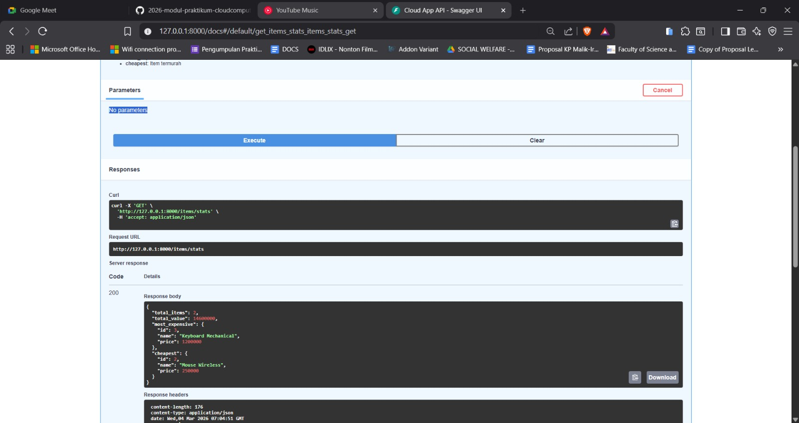
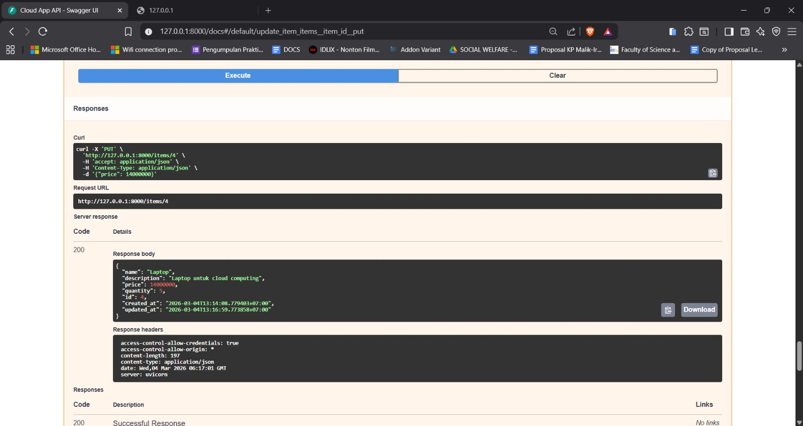
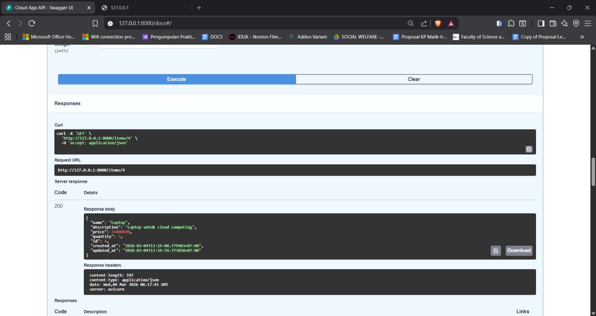
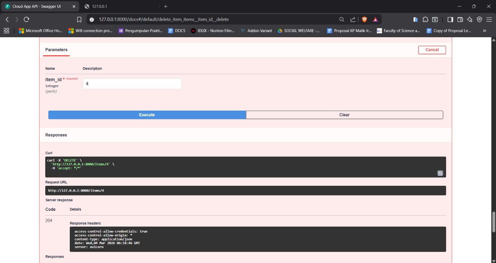

## Hasil Test API
### POST/Items - Buat 3 item

Gambar diatas menunjukkan hasil penambahan 3 items berupa
- nama item yaitu "Laptop"
- price dengan harga "15000000"
- description yaitu "Laptop untuk cloud computing"
- quantity yaitu "5"

### GET/Items-harus mengembalikan 3 items dengan total: 3

Mengambil data dari item yang dimasukkan, tampilan di atas menunjukkan bahwa item-item yang telah didaftarkan telah tesimpan kedalam database, dan data tersebut ditampilkan saat saat menjalankan query ```'GET'```.

### GET /items/4 — Harus mengembalikan item "Laptop"

Pada tampilan diatas, dilakukan perintah untuk menampilkan salah satu data item dengan id '4' sehingga data yang ditampilkan adalah laptop 1 laptop yang memiliki id sesuai.

### GET /items/stats

Gambar diatas menunjukkan tahap untuk menampilkan statistik/ringkasan dari semua item yang ada didalam database.
Berikut beberapa fungsi yang dikembalikan
- ```total_item``` : untuk menghitung jumlah total item yang ada di database
- ```total_value``` : menghitung total nilai semua item dengan rumus ```price x quantity``` lalu dijumlahkan
- ```most_expensive``` : mencari item dengan harga tertinggi
- ```cheapest``` mencari item dengan harga terendah

### PUT /items/4 — Update harga:

Pada tahap ini, dilakukan proses update harga laptop dari wang awalnya adalah '15000000' menjadi '14000000'.

### GET /items/4 — Harga harus berubah ke 14000000

Berdasarkan gambar yang ditampilkan, database telah berhasil menyimpan hasil update harga yang telah diubah menjadi '14000000'.

### GET /items?search=laptop — Harus mengembalikan 1 item

Gambar diatas merupakan proses yang dilakukan untuk menjampilkan data harga laptop yang telah diupdate.

### DELETE /items/4 — Harus response 204

Proses diatas merupakan proses penghapusan items yaitu laptop dengan id '4' menggunakan perintah 'DELETE'

### GET /items/4 — Harus response 404

gambar terakhir menampilkan '404' yang berarti bahwa data item yang telah dihapus sudah tidak ada lagi didalam database.
