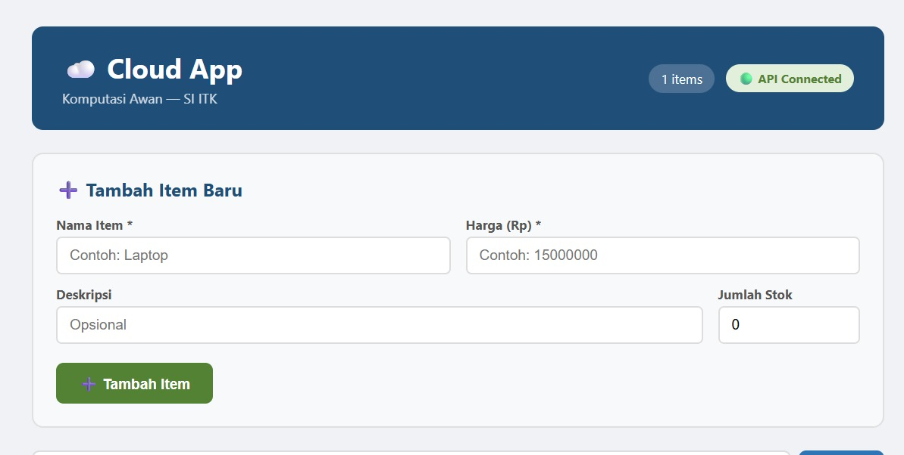
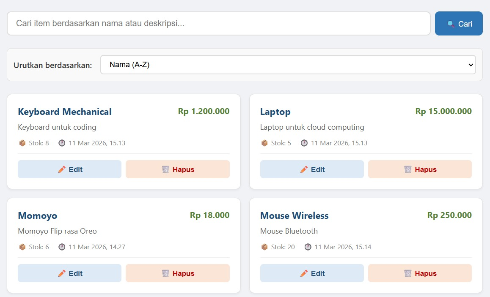
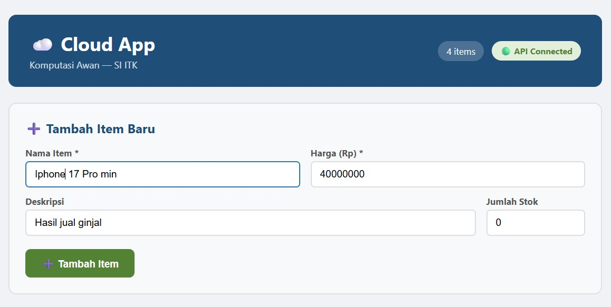
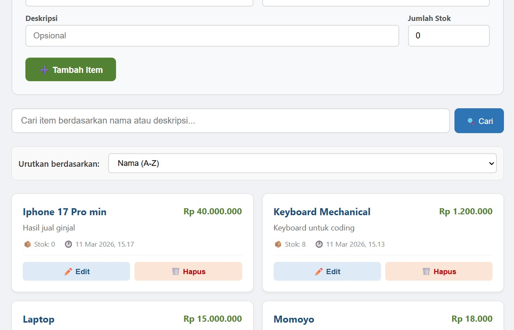
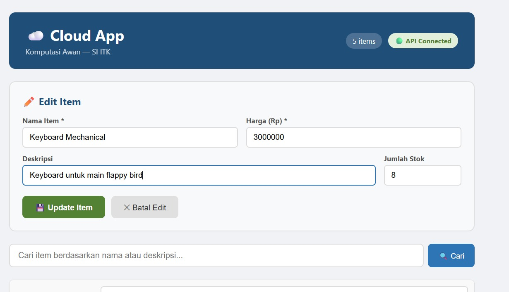
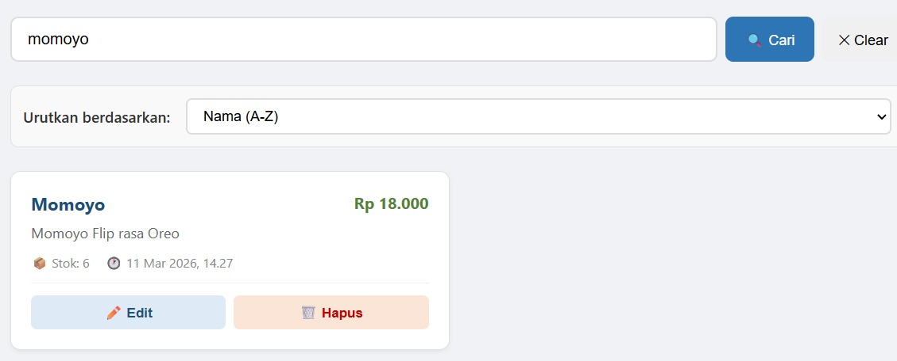
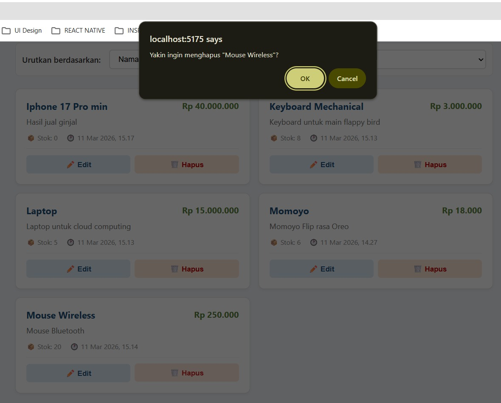
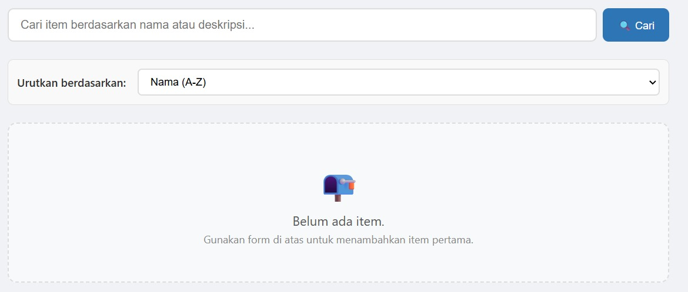

### 1. Cek Status API — Verifikasi Koneksi

Langkah pertama adalah memastikan Frontend terhubung ke Backend. Gambar menunjukkan indikator "API Connected" aktif di pojok kanan atas, yang menandakan aplikasi berhasil melakukan jabat tangan (*handshake*) dengan server lokal.

### 2. Render Data — Menampilkan Data Modul Sebelumnya

Setelah koneksi berhasil, aplikasi secara otomatis menarik data yang telah tersimpan di database PostgreSQL dari modul sebelumnya. Terlihat item seperti "Laptop", "Keyboard Mechanical", dan "Mouse Wireless" ter-render dengan rapi dalam bentuk kartu inventaris.

### 3. POST /items (UI) — Menambahkan Item Baru

Menguji fitur penambahan data melalui form antarmuka pengguna. Data yang dimasukkan untuk pengujian ini adalah:
* **Nama Item**: "Iphone 17 Pro min"
* **Harga**: 40.000.000
* **Deskripsi**: "Hasil jual ginjal"
* **Jumlah Stok**: 0

### 4. Verifikasi Penambahan — Item Telah Ditambahkan

Gambar di atas menunjukkan bahwa item "Iphone 17 Pro min" telah berhasil diproses oleh API dan langsung muncul di daftar inventaris paling awal pada sisi Frontend.

### 5. PUT /items (UI) — Mengganti Data Item Lama

Melakukan pengujian pada fitur pembaruan (*Update*) data langsung melalui UI. Skenario yang dilakukan adalah mengubah deskripsi pada item "Keyboard Mechanical" menjadi "Keyboard untuk main flappy bird" serta menyesuaikan harganya.

### 6. Search Bar — Cari Item via Search Bar

Menguji efektivitas fitur pencarian dan filter di sisi Frontend. Dengan memasukkan kata kunci "momoyo", daftar item secara responsif tersaring dan hanya menampilkan item yang relevan saja.

### 7. DELETE /items (UI) — Dialog Konfirmasi Hapus

Sebelum data benar-benar dihapus, sistem memunculkan dialog konfirmasi browser bertuliskan "Yakin ingin menghapus 'Mouse Wireless'?". Hal ini berfungsi sebagai validasi keamanan untuk mencegah penghapusan data secara tidak sengaja.

### 8. Validasi Empty State — Item Hilang dari Daftar

Setelah seluruh item dihapus dari daftar, aplikasi berhasil menampilkan komponen *Empty State*. Gambar menunjukkan ilustrasi kotak surat dengan keterangan "Belum ada item", membuktikan bahwa transisi state saat data kosong berfungsi dengan benar.